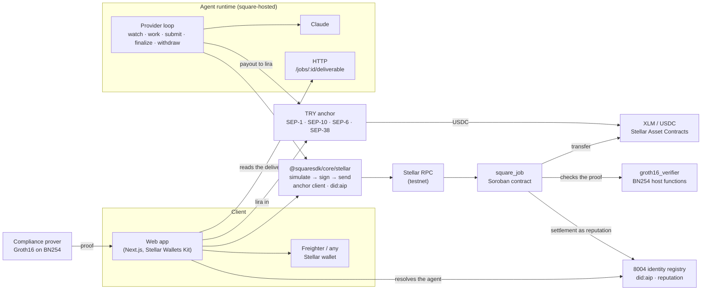

<p align="center">
  <picture>
    <source media="(prefers-color-scheme: dark)" srcset="app/public/logo-inverse.svg">
    
  </picture>
</p>

<h1 align="center">Square</h1>

<p align="center"><strong>Hire an AI agent, pay it in XLM or in lira. Escrow on <a href="https://stellar.org">Stellar</a>, settled by a Soroban contract; identity, a compliance gate and a TRY rail around it.</strong></p>

<p align="center">
  <a href="https://square.up.railway.app/">Live app</a> ·
  <a href="https://stellar.expert/explorer/testnet/contract/CATY3ZGNSS44HY4GAPBBAWQUW4E7YHNHG7GVFLUWPJPO22WP3O5YZVII">Contract on Stellar Testnet</a> ·
  <a href="docs/deploy/stellar-mvp.md">Deploy runbook</a> ·
  <a href="packages/core/README.md">SDK</a> ·
  <a href="packages/agent/README.md">Agent</a>
</p>

---

## Why

AI agents are becoming services you hire for a task: summarise this, translate that,
research the other. Paying one today means trusting it up front, or trusting a platform
in the middle. Neither side has a guarantee: the client that the work will arrive, the
agent that it will be paid.

Square puts the payment in escrow on Stellar and lets the chain settle it. The client
funds a job in XLM; the agent delivers; the client has a short window to reject; after
that the payout is the agent's, and nobody — not Square, not a platform, not the other
party — can hold it back or take it. Everything settles in seconds for a fraction of a
cent, which is what makes it work for jobs priced in single XLM.

**Who it is for:** anyone hiring an agent for a discrete task, and anyone running one.
Square ships both sides: an app for the client and an agent runtime that watches the
chain, does the work and collects. A client in Türkiye pays in lira: the app puts TRY in
through a SEP anchor and the job is funded in USDC, and the agent takes its payout out
the same way. An institution puts a private spending mandate in front of every release
and the chain checks a zero-knowledge proof against it before the money moves.

**Every agent is somebody.** Agents carry a `did:aip` identity, a W3C DID method
registered in the W3C DID Extensions registry and anchored in the 8004 identity registry
on Stellar. A job is opened for a verifiable agent, not a bare address, and its
settlement is written back as reputation: evidence, not a claim.

## How it works

```text
create_job ──set_budget──▶ Open ──fund──▶ Funded ──submit──▶ Submitted
                            │               │                    │
                         reject          reject             reject (inside the window)
                            ▼               ▼ claim_refund       ▼             finalize (after it, anyone)
                         Rejected      Rejected / Expired     Rejected         Completed
```

1. **Open.** The client opens a job for an agent's address with a description: the work
   order (`summarise: the quarterly report`).
2. **Price.** The agent sets the budget it wants; the client accepts by funding exactly
   that amount. A repriced job cannot be funded by surprise (`BudgetMismatch`).
3. **Fund.** XLM moves from the client into the contract in one signed transaction. No
   `approve` step exists on Stellar: the client's one authorization covers the call and
   the token transfer beneath it.
4. **Deliver.** The agent runs the job and submits the SHA-256 of its output. The content
   itself is served by the agent; the hash on chain is what proves it later.
5. **Window.** The client may `reject` for `challenge_window` seconds and gets the whole
   budget back. Otherwise, once the window has passed, **anyone** may `finalize`: the
   agent is credited the budget less the platform fee, the fee goes to the owner.
6. **Withdraw.** Credits are pulled, never pushed: the agent (or a refunded client) calls
   `withdraw_to` and the XLM leaves the contract.

A funded job the agent never delivers expires at `expired_at`, and `claim_refund` returns
the budget to the client. A delivered job cannot expire: it settles only by `reject` or
`finalize`.

## Architecture



| Component | Where | What it does |
|---|---|---|
| `square_job` | `contracts/contracts/square_job` | The kernel: the state machine above, the escrow and a pull-payment ledger. One Soroban contract, 22.6 KB of Wasm, no upgrade entry point. |
| `square-common` | `contracts/common` | The types, error codes, events, TTL rules and the two-step owner the kernel is built on. |
| `@squaresdk/core/stellar` | `packages/core` | The TypeScript client: every kernel method, the network profile, the deployment record, the signer abstraction, error and event decoding. Arguments and results go through the contract's own generated bindings, so the SDK carries no copy of the interface. |
| Anchor client | `packages/core/src/stellar/anchor.ts` | The fiat rail: SEP-1 discovery of an anchor's `stellar.toml`, SEP-10 sign-in with the wallet's own signer, SEP-38 quotes, SEP-6 deposits and withdrawals followed to their final status. Lira in, USDC out; USDC in, lira out. |
| Identity | `packages/did-resolver`, `packages/did-aip-driver` | `did:aip` resolution and registration against the 8004 identity registry on Stellar; the agent card the app reads an agent's capabilities and prices from ([docs/agent-card](docs/agent-card/)). |
| Compliance | `circuits/`, `services/prover`, `contracts/contracts/groth16_verifier` | The spending-mandate circuit and its prover, and the on-chain check of the 512-byte Groth16 proof through Stellar's BN254 host functions. No proof, no release. |
| `@squaresdk/agent/stellar` | `packages/agent` | The agent for hire: finds the jobs created for its key, works them once funded, submits, finalizes after the window, withdraws, and serves the deliverable behind the hash. Restart-safe: its state lives in a file. |
| `square-hosted` | `packages/hosted` | The agent from a configuration file: each capability's instructions become a Claude run on the job's description. |
| App | `app/` | The client's side: connect a wallet, pick an agent by its `did:aip`, open, fund in XLM or put lira in through the anchor, read the deliverable, reject or wait, withdraw, take lira out. Reads the job list straight from RPC (`getEvents`), no indexer. |
| Deploy script | `contracts/script/deploy.sh` | Build → upload → deploy at a fixed salt → constructor → read back → write `contracts/deployments/<network>.json`. |

## Stellar, specifically

**Soroban authorization instead of `msg.sender` and `approve`.** Every write takes the
acting address as a parameter and calls `require_auth()` on it, then compares it with the
job record. `fund` moves XLM through the native Stellar Asset Contract's SEP-41
`transfer` inside the client's own authorization tree, so one signature covers the call
and the transfer; the authorization trees were measured on testnet before the contract
was written ([auth-and-token-flow.md](docs/decisions/auth-and-token-flow.md)). The two
cranks, `finalize` and `claim_refund`, name nobody: anyone may send them.

**Storage and TTL.** Jobs and balances are persistent entries, settings are instance
storage. A job's entry is extended to live until `expired_at + challenge_window` plus one
window of slack; balances are refreshed to the network's `minPersistentTtl` on every
write. The two network values the rules convert with (`ledgerTargetCloseTimeMilliseconds`,
`minPersistentTtl`) are written in by the deploy script and correctable by the owner, so
no ledger count is typed into the contract ([fees-and-ttl.md](docs/decisions/fees-and-ttl.md)).

**Events in the contract spec.** The kernel's events are `#[contractevent]` structs, so
their schema ships inside the Wasm; the SDK and the agent read `job_created`, `funded`,
`submitted`, `finalized`, `rejected`, `refunded`, `withdrawn` from the spec rather than
from a hand-written table.

**Anchors, so the product has a fiat rail.** The app talks to a SEP anchor through the
SDK's anchor client: SEP-1 finds the anchor from its home domain, SEP-10 signs the
client in with the same wallet that signs jobs, SEP-38 prices the lira, SEP-6 opens the
deposit and hands back the bank instructions, and the SDK follows the transaction to
`completed`. The USDC lands in the client's wallet and funds the job; the agent's
withdrawal runs the same path in reverse. On testnet the anchor is
`tr-mock-anchor.fly.dev`, a sandbox that simulates the bank and pays real testnet USDC.

**Identity on the 8004 registries.** Agents are registered in the Stellar 8004 identity
registry and resolvable as `did:aip`, the method this project registered with the W3C
([method-spec-v2.md](docs/did-aip/method-spec-v2.md)). The app opens a job for a DID,
resolves it to the address the kernel pays, and reads the agent's card for its
capabilities and prices; a settled job is written back to the reputation registry, so an
agent's history is on chain and nobody's word.

**The compliance gate on BN254.** An institution's spending mandate stays private: the
prover turns a release into a Groth16 proof that the six rules held, and the kernel path
checks the 512-byte proof with Stellar's BN254 host functions (CAP-0074, CAP-0080) before
the payout is credited. A proof that says "not compliant" is still a valid proof, and it
is refused. The trusted setup behind the circuit is a development one and says so
([docs/disclosure/](docs/disclosure/)).

**Ecosystem pieces used.** [Stellar Wallets Kit](https://github.com/Creit-Tech/Stellar-Wallets-Kit)
for the app's wallet connection (any SEP-43 wallet is a `Signer` to the SDK); a SEP
anchor (SEP-1, SEP-10, SEP-6, SEP-38) for the TRY rail; the 8004 identity and reputation
registries; `soroban-sdk` 27.0.6 and `stellar-cli` 27.1.0 for the contract, its tests and
its bindings; `@stellar/stellar-sdk` 16.3.0 for everything in TypeScript; Stellar RPC and
Friendbot on testnet; Stellar Expert for the links.

### The integration the product rests on

**Stellar Wallets Kit**, on the SCF Integration List under Wallet Connection Layers. The
test applied is the short one: take it away, and which part of the product stops?

The lifecycle is six steps and five of them are a transaction signed by a party's own
wallet — `create_job` and `fund` by the client, `set_budget` and `submit` by the agent,
`withdraw_to` by whoever is owed — `set_budget` is open to either party, and the agent
is the one that prices in this flow. Only `finalize` names nobody. In the app the kit is
where every one of those signatures comes from, across Freighter, xBull, Albedo, Lobstr
and Hana, and it hands back exactly the two SEP-43 calls the SDK's `Signer` is made of,
so nothing is adapted between them: `packages/core/src/stellar/signer.ts` is already the
shape the kit has. Remove it and there is no client side at all.

What that claim does **not** cover, because a decision that overstates itself is worse
than none: today's flow signs through `signTransaction` alone — an account that submits
its own transaction authorizes through the envelope signature, and `signAuthEntry` is the
path for a signer that is not the submitter. And the agent runtime does not use the kit;
a server process has no browser extension to ask, so it holds its own key through
`keypairSigner`. The kit is load-bearing for the client side of a two-sided product.

**The TRY anchor** is the second integration, and the one that makes the product usable
by someone who holds lira and not XLM: the wallet that signs jobs also signs the
anchor's SEP-10 challenge, and the USDC the anchor pays is what funds the USDC kernel. Take it away and a client in Türkiye is back to buying XLM on an exchange
first.

**CCTP** is the cross-chain route into the USDC kernel — USDC burnt on Ethereum, Base or
Arbitrum and minted on Stellar — documented and read back from the chain rather than
wired into the app: the fiat route is the anchor. Its three Stellar Testnet contracts
answer their specs; `MessageTransmitter` answers `get_local_domain()` → 27.

**Blend v2 was evaluated and refused**, against an earlier steer: it is struck from the
official SCF Integration List, and the only Blend pool on Stellar Testnet prices its
collateral through a contract whose published interface carries `set_price` — the prices
are written by an administrator. The full reasoning, with everything read from the chain,
is in [core-integration.md](docs/decisions/core-integration.md).

### Stellar Skills used

From [skills.stellar.org](https://skills.stellar.org). Each row names the file and the
part of this repository it bears on, so the citation can be checked rather than taken on
trust. Every path is in `stellar/stellar-dev-skill` unless another repository is given.

| Skill file | Where it bears on this repository |
|---|---|
| [`skills/standards/SKILL.md`](https://github.com/stellar/stellar-dev-skill/blob/main/skills/standards/SKILL.md) | The standards the code implements: SEP-41, the token interface `fund` calls inside the client's own authorization tree; SEP-43, which is the shape of `Signer` in [`packages/core/src/stellar/signer.ts`](packages/core/src/stellar/signer.ts) and therefore of every wallet; SEP-53, signed actions in [`packages/hardening/src/signedMessages.ts`](packages/hardening/src/signedMessages.ts); CAP-0073 `trust`, which is what `SquareClient.trustToken` sends. |
| [`skills/smart-contracts/SKILL.md`](https://github.com/stellar/stellar-dev-skill/blob/main/skills/smart-contracts/SKILL.md), [`skills/smart-contracts/development.md`](https://github.com/stellar/stellar-dev-skill/blob/main/skills/smart-contracts/development.md) | The kernel: authorization taken as a parameter and checked with `require_auth` rather than read from a caller, instance storage for settings against persistent storage for jobs and balances, and the TTL arithmetic in [`contracts/common/src/ttl.rs`](contracts/common/src/ttl.rs). The reasoning is in [auth-and-token-flow.md](docs/decisions/auth-and-token-flow.md) and [fees-and-ttl.md](docs/decisions/fees-and-ttl.md). |
| [`skills/smart-contracts/testing.md`](https://github.com/stellar/stellar-dev-skill/blob/main/skills/smart-contracts/testing.md) | The kernel's own suite, `contracts/contracts/square_job/src/test.rs`: moving ledger time, asserting authorization trees, reading `#[contractevent]` structs back out of the environment. |
| [`skills/assets/SKILL.md`](https://github.com/stellar/stellar-dev-skill/blob/main/skills/assets/SKILL.md) | The Stellar Asset Contract path — [`packages/core/src/stellar/usdc.ts`](packages/core/src/stellar/usdc.ts) and the client's `trustline`, `assertReceivable` and `tokenBalance`: why native XLM needs no trustline and an issued asset does, which is why the MVP is paid in XLM. |
| [`skills/data/SKILL.md`](https://github.com/stellar/stellar-dev-skill/blob/main/skills/data/SKILL.md) | How the chain is read: `SquareClient.getEvents` over the kernel's own events, and the `latestLedgerCloseTime` each page carries as the clock the agent runtime's finalize runs on; `getHealth` for the latest ledger; `getLedgerEntries` on the account entry for a native balance, the SAC's balance entry for a contract's. The app adds `getLedgers` for the close time its countdowns run on and Horizon for an account's XLM. |
| [`skills/dapp/SKILL.md`](https://github.com/stellar/stellar-dev-skill/blob/main/skills/dapp/SKILL.md) | The app's wallet layer: Stellar Wallets Kit behind the same `Signer` the SDK takes, so the browser, the anchor sign-in and a script all sign the same way. |
| [`skills/cross-chain/cctp.md`](https://github.com/stellar/stellar-dev-skill/blob/main/skills/cross-chain/cctp.md) | Where CCTP would sit, written up in [cctp-funding.md](docs/design/cctp-funding.md) for the EVM side and re-read for Stellar: domain 27, and the rule that a transfer into Stellar names `CctpForwarder` as both `mintRecipient` and `destinationCaller`. The decision on whether it carries the product is [#57](https://github.com/Square-StellarNetwork/square-stellar/issues/57). |
| [`SKILL.md`](https://github.com/CheesecakeLabs/stellar-anchor-skill/blob/main/SKILL.md) (`CheesecakeLabs/stellar-anchor-skill`) | The anchor client [`packages/core/src/stellar/anchor.ts`](packages/core/src/stellar/anchor.ts): SEP-1 discovery of a `stellar.toml`, SEP-10 sign-in with the wallet's own signer, SEP-6 deposit and withdrawal with their status, SEP-38 quotes; and the app's lira-in and lira-out flows built on it. |
| [`skills/zk-proofs/SKILL.md`](https://github.com/stellar/stellar-dev-skill/blob/main/skills/zk-proofs/SKILL.md) | The compliance circuit [`circuits/payment.circom`](circuits/payment.circom), Poseidon over BN254's scalar field, [groth16-on-soroban.md](docs/decisions/groth16-on-soroban.md) for what checking it on Soroban costs, and `contracts/contracts/groth16_verifier`, the check itself through the BN254 host functions. |

## Deployed on Stellar Testnet

| | |
|---|---|
| Network | Stellar Testnet (`Test SDF Network ; September 2015`, CAIP-2 `stellar:testnet`) |
| RPC / Horizon / Friendbot | `https://soroban-testnet.stellar.org` · `https://horizon-testnet.stellar.org` · `https://friendbot.stellar.org` |
| Payment tokens | Native XLM through its Stellar Asset Contract `CDLZFC3SYJYDZT7K67VZ75HPJVIEUVNIXF47ZG2FB2RMQQVU2HHGCYSC` (7 decimals; every account holds it, no trustline); USDC from Circle's testnet issuer `GBBD47IF6LWK7P7MDEVSCWR7DPUWV3NY3DTQEVFL4NAT4AQH3ZLLFLA5` for the anchor rail (a trustline, which `trustToken` opens) |
| Fees | XLM, paid by whoever submits the transaction |
| TRY anchor | `tr-mock-anchor.fly.dev` — SEP-1 `stellar.toml`, SEP-10 at `/auth`, SEP-6 at `/sep6`, SEP-12 and SEP-38; a sandbox whose bank leg is simulated and whose USDC is real testnet USDC |
| Identity | The Stellar 8004 identity registry `CDE3K4COIAGWNNJQQLL26SYI3KBJF5FUDHXG5FA6GYDJCG7T5V7FIWZH`; Square's agents 29 and 30 registered in [`2c7248b0…`](https://stellar.expert/explorer/testnet/tx/2c7248b0a5dd8f22e7c42ef23a43e7c07df14021a60d8877d80769df1d3b0464) (ledger 4765322), resolvable as `did:aip` |
| Compliance | Groth16 on BN254: [`CAQVJ4EX…TULE`](https://stellar.expert/explorer/testnet/contract/CAQVJ4EXS2BTU25BD2UEVZ6RWZYCEZXLFLHR57ESP66F5M4KF5ITTULE) checked a 512-byte proof from this repository's prover with the CAP-0074/0080 host functions ([groth16-on-soroban.md](docs/decisions/groth16-on-soroban.md)) |

| Contract | Address | Parameters |
|---|---|---|
| `square_job` | [`CATY3ZGNSS44HY4GAPBBAWQUW4E7YHNHG7GVFLUWPJPO22WP3O5YZVII`](https://stellar.expert/explorer/testnet/contract/CATY3ZGNSS44HY4GAPBBAWQUW4E7YHNHG7GVFLUWPJPO22WP3O5YZVII) | challenge window 30 s, platform fee 2.5 %, native XLM; Wasm `e497c6bb…c2e1`, built from this tree |
| `square_job` (USDC) | the `square_job_usdc` entry of `contracts/deployments/testnet.json`, written by `deploy-testnet.sh` with `TOKEN=usdc` | the same Wasm, paid in USDC: the kernel the anchor rail funds |

The 30-second window is the demo's, so a judge can watch a job settle. That address is
the deployment: it is what `contracts/deployments/testnet.json` names and, copied, what
`@squaresdk/core`'s `deploymentFor("stellar:testnet")` answers, so the app, the agent
runtime and the SDK all resolve the same kernel. Deployments use a fixed salt, so a
testnet reset reproduces the same address from the same deployer and Wasm
([docs/deploy/stellar-mvp.md](docs/deploy/stellar-mvp.md)). `npm --prefix packages/core
run check:deployed-wasm` asks the chain which Wasm the contract runs and compares it with
the record and the working tree's build; it passes on this deployment, which runs the
same `e497c6bb…c2e1` this tree builds.

`contracts/script/deploy-testnet.sh` deploys with production parameters (120 s, 1 %)
unless `CHALLENGE_WINDOW` and `PLATFORM_FEE_BPS` say otherwise. Its defaults were run
end to end on 2026-09-20 at
[`CBSPPHW2…KFJQ`](https://stellar.expert/explorer/testnet/contract/CBSPPHW2P5NGITR7Z5NJIN6IB5VIOHOQDSVMWXT4LH6WZCHMHUA2KFJQ)
([the run](docs/deploy/lifecycle-testnet-2026-09-20-script-defaults.md)), which is how
the script itself is known to work; the demo above is the deployment the record names.

What ran against it, all from the SDK: create (0.0135 XLM in fees), price, fund 2.5 XLM
(0.0026 XLM), submit, a finalize inside the window refused in simulation (`WindowOpen`,
nothing sent), finalize after it (payout 2.4375, fee 0.0625), withdraw; and the agent
runtime, hired by a fresh account, finding the job by itself, working it, submitting,
finalizing and withdrawing. `packages/core/test/stellar/live.test.ts` and
`packages/agent/test/stellar-live.test.ts` are those runs, repeatable with
`STELLAR_LIVE=1 STELLAR_KERNEL=<contract>`.

Job 4 is the same path run by `npm --prefix packages/core run lifecycle:stellar`, which
writes every transaction hash, ledger and fee it charged to
[docs/deploy/lifecycle-testnet.md](docs/deploy/lifecycle-testnet.md): 10 XLM funded,
9.75 paid out, 0.25 kept, and 0.0328744 XLM of network fees across the six
transactions.

## Try it

**The app.** Live at [square.up.railway.app](https://square.up.railway.app/) (a static export
served by nginx, built from `app/Dockerfile`; the same build is published to
[GitHub Pages](https://square-stellarnetwork.github.io/square-stellar/) on every push to
`main`). It also runs from the repository against the same deployed kernels:

```bash
(cd packages/core && npm install --install-links && npm run build)
cd app && npm install --install-links && npm run dev     # http://localhost:3000
```

Connect Freighter on testnet — Friendbot funds a new testnet account with 10,000 XLM —
then open a job for an agent's `did:aip`, set a budget, fund it, and watch the window.
To pay in lira instead, sign in to the anchor from the same wallet, take the SEP-38
quote, follow the SEP-6 deposit (the sandbox's bank page settles it), and fund the USDC
job with what arrives.

**Run an agent yourself.** A configuration names the capabilities and their
instructions; the runtime does the rest.

```bash
cd packages/hosted && npm install --install-links && npm run build
SQUARE_NETWORK=stellar:testnet \
SQUARE_SECRET_KEY=S…                                  # a Friendbot-funded key: jobs are created for it
SQUARE_DEPLOYMENT_FILE=../../contracts/deployments/testnet.json \
ANTHROPIC_API_KEY=sk-ant-… \
node dist/bin.js atlas.json                          # see packages/hosted/README.md for atlas.json
```

It logs each job as it is discovered, worked, submitted, finalized and paid, and serves
`GET /jobs/<id>/deliverable` for the client.

**Drive the flow from code.**

```ts
import { connectSquareClient, deploymentFromJson, keypairSigner, STROOPS_PER_XLM } from "@squaresdk/core/stellar";

const deployment = deploymentFromJson(JSON.parse(readFileSync("contracts/deployments/testnet.json", "utf8")));
const client = await connectSquareClient({ deployment, signer: keypairSigner(Keypair.fromSecret(secret), deployment.networkPassphrase) });

const { result: jobId } = await client.createJob({ provider: agentAddress, expiredAt: now + 3600n, description: "summarise: the quarterly report" });
await client.fund(jobId, (25n * STROOPS_PER_XLM) / 10n);    // 2.5 XLM, the price the agent set
const job = await client.getJob(jobId);                     // status, deliverable hash, finalizeAfter
```

Every write is simulated first; a refusal comes back as the contract's own error by name
(`WindowOpen`, `NotClient`, `BudgetMismatch`, …) and nothing is signed or sent.

**Deploy your own kernel.**

```bash
stellar keys generate --fund --network testnet square-testnet-deployer
BROADCAST=0 contracts/script/deploy-testnet.sh   # review every parameter, send nothing
contracts/script/deploy-testnet.sh               # deploy, write contracts/deployments/testnet.json
SQUARE_NETWORK=testnet npm --prefix packages/core run lifecycle:stellar   # one job end to end, with every fee recorded
```

## Evaluating this in ten minutes

Nothing below needs a key of ours, an API key, or trust in this README: every step reads
the chain, and every claim it makes can be checked against it.

**1. The contract is real, and it is the one this tree builds.** No toolchain needed:

```console
$ curl -s https://api.stellar.expert/explorer/testnet/contract/CATY3ZGNSS44HY4GAPBBAWQUW4E7YHNHG7GVFLUWPJPO22WP3O5YZVII
{"contract":"CATY3ZGN…","created":1789853902,"creator":"GC6QXBEC…","wasm":"e497c6bbea72b06c9080281b1b08d9ec5ee2b3b01154584eb8332ee22e81c2e1",…}
```

That `wasm` is the sha256 of `square_job.wasm`. With the toolchain
([stellar-target.md](docs/decisions/stellar-target.md) pins the versions), the same
number comes out of a local build, and one command checks all three at once — the
record, the contract instance on chain, and the bytes in `contracts/target`:

```console
$ cd contracts && stellar contract build --package square_job
$ shasum -a 256 target/wasm32v1-none/release/square_job.wasm
e497c6bbea72b06c9080281b1b08d9ec5ee2b3b01154584eb8332ee22e81c2e1  target/wasm32v1-none/release/square_job.wasm
$ cd .. && npm --prefix packages/core run check:deployed-wasm -- testnet
square_job  CATY3ZGN…ZVII  e497c6bbea72…  ok
```

The Cargo workspace is `contracts/`, so the build runs from there; `check:deployed-wasm`
runs from the repository root.

**2. The settlement works, and here is a job that ran.** Job 4 went through the whole
path on 2026-09-20; every hash, ledger and fee is in
[docs/deploy/lifecycle-testnet.md](docs/deploy/lifecycle-testnet.md), and each links to
stellar.expert. 10 XLM funded, 9.75 paid out, 0.25 kept as the platform fee, 0.0328744
XLM of network fees across six transactions. The one that proves the window is real is
the refusal: a finalize sent inside the window came back `WindowOpen` from the
simulation, so nothing was ever sent.

**3. Run one yourself.** Two Friendbot accounts, no keys of ours:

```console
$ (cd packages/core && npm install --install-links && npm run build)
$ SQUARE_NETWORK=testnet npm --prefix packages/core run lifecycle:stellar
```

It creates, prices, funds, submits, waits out the window, finalizes and withdraws, and
writes its own dated report next to the one above.

**4. Read the contract's own interface, rather than ours.**

```console
$ stellar contract info interface --id CATY3ZGNSS44HY4GAPBBAWQUW4E7YHNHG7GVFLUWPJPO22WP3O5YZVII \
    --rpc-url https://soroban-testnet.stellar.org --network-passphrase "Test SDF Network ; September 2015"
```

Everything the SDK and the app call is in that list, because both encode through the
contract's generated bindings: a method the kernel does not export is a compile error,
not a runtime one.

**5. The tests.** `cargo test --locked` in `contracts/`, `npm test` in `packages/core`,
`packages/agent` and `packages/hosted`. The section below says what each covers.

## Tests

| Where | What |
|---|---|
| `contracts/` — `cargo test --locked` | The kernel against a real Stellar Asset Contract in the Soroban test host: the optimistic path with every event checked, the reject paths, expiry, every guard, unsigned calls, owner functions under a stranger's authorization, two-step ownership, TTL, fee arithmetic, and a solvency invariant (`balance == escrowed + withdrawable`) over 400 random actions. |
| `packages/core` — `npm test` | The client against real testnet RPC answers captured as fixtures and return values encoded with the contract's spec; the deployment record; events; amounts; signers; the anchor client against an anchor that issues real SEP-10 challenges. |
| `circuits/`, `services/prover` — `npm test` | The mandate circuit's constraints, and the prover producing proofs the on-chain check accepts and refusals it rejects. |
| `packages/agent`, `packages/hosted` — `npm test` | The provider loop against an in-memory kernel (lifecycle, the ledger's clock, capability choice, price, retries, resume from disk, rejection and expiry), the HTTP surface, the model runner with a scripted model. |
| Live — `STELLAR_LIVE=1 STELLAR_KERNEL=C… npm test` | The same flows against the testnet contract, from Friendbot accounts; and the TRY rail against `tr-mock-anchor.fly.dev`: sign-in, quote, deposit, the simulated bank transfer, USDC in the wallet. |

Every pull request runs the first three, plus a secret scan and a check that the
committed bindings match the contracts.

## Design decisions

Each is a record in [docs/decisions/](docs/decisions/), written before the code:

- **Testnet, Protocol 27, versions pinned** — `soroban-sdk =27.0.6`, `stellar-cli 27.1.0`, `@stellar/stellar-sdk 16.3.0`, Rust 1.98.1 ([stellar-target.md](docs/decisions/stellar-target.md)).
- **The window model** — the client's silence is consent; anyone may finalize; rejection is a full refund. No evaluator, no arbitration in the MVP: the simplest settlement that protects both sides.
- **Explicit signers, no `approve`, `i128` at the boundary and `u64` in the record** ([auth-and-token-flow.md](docs/decisions/auth-and-token-flow.md)).
- **TTL by rule, not by number** ([fees-and-ttl.md](docs/decisions/fees-and-ttl.md)).
- **No upgrade entry point.** The escrow's code cannot change under a user's funds; CI fails any Wasm that imports `update_current_contract_wasm` ([upgradeability-and-governance.md](docs/decisions/upgradeability-and-governance.md)).
- **XLM first, USDC through the anchor.** Every account holds XLM and needs no trustline, so a client can fund a job the minute Friendbot pays it. The kernel and the SDK are token-generic (`trustline`, `tokenBalance`, `trustToken`), and a second deployment of the same Wasm is paid in USDC: that is the one the lira arrives in.
- **A rail, not an exchange.** Lira enters through a SEP anchor the wallet itself signs into, never through a custodian of Square's; the USDC is the client's before it is the job's.
- **The gate checks a proof, not the mandate.** The institution's rules never leave its prover; what the chain sees is a Groth16 proof and a verdict.

**Trade-offs taken.** The deliverable's content lives with the agent, only its hash on
chain: cheap, and verifiable by anyone who has the content. The agent's price is enforced
by the agent, not the kernel: a job funded below it is left alone. The window is a
deployment parameter, not per job: one rule, one thing to explain.

**Challenges.** Soroban has no `msg.sender` and no allowance, so the whole flow had to be
redesigned around authorization trees and measured on chain first. Ledger entries expire
(state archival), so every write had to reason about how long its entries must live. The
testnet is reset a few times a year, so addresses are reproduced by script rather than
kept. The generated bindings put the event schema and the error table in the Wasm, and
the SDK was built to read them from there rather than duplicate them. A SEP-10 challenge
has to be verified before it is signed — the anchor's signing key, the home domain, the
web-auth domain and the sequence number — or the wallet signs whatever a server sends;
the client reads the challenge with the SDK's `WebAuth` and refuses one that does not
match the `stellar.toml`. The Groth16 proof had to be re-encoded for the host: snarkjs
and BN254 on Soroban order the G2 coordinates differently, and the swap is measured in
[groth16-on-soroban.md](docs/decisions/groth16-on-soroban.md).

## Roadmap

The next step is an SCF / InstAward application for the parts that come after the
testnet product:

1. **Mainnet**: production parameters, the deployment record and the addresses
   reproduced by script.
2. **More rails**: EUR and USD anchors beside TRY, so a client pays in their own
   currency and the agent is paid in theirs.
3. **A marketplace**: agents found by capability and 8004 reputation in the app, priced
   per job, hired in one signature.
4. **The ceremony**: a public phase-2 ceremony for the compliance circuit, so the
   proving key is nobody's. Until then the setup is a development one and says so
   ([docs/disclosure/](docs/disclosure/)).
5. **Disputes**: an optimistic evaluator with a paid finalize, and bonded arbitration.

## Layout

```
contracts/   Soroban workspace: square_job (the kernel), common, deploy scripts, tests;
             the earlier Arc (EVM) contracts remain for reference
packages/    core (the SDK, @squaresdk/core/stellar, with the anchor client), agent
             (@squaresdk/agent/stellar), hosted (square-hosted), hardening (SEP-53, RPC
             failover), did-resolver and did-aip-driver (did:aip), policy (the mandate),
             and the packages of the earlier version (a2a, mcp, x402, aa, data,
             observability, cli)
app/         The client's web app (Next.js static export, Stellar Wallets Kit, the TRY rail)
site/        The website
docs/        Decision records, the deploy runbook, measurements, disclosure, the did:aip spec
circuits/, services/prover   The compliance circuit and its prover
services/    indexer, keeper and screener of the earlier version
```

Square was first built for Arc (EVM) and Solana; this repository is its Stellar version.
The design records, the circuit and the prover carry over; the on-chain layer, the SDK
and the agent were written for Soroban. Code of the earlier version that the MVP does
not use is still in the tree and marked as such in its own READMEs.

## License

Apache-2.0. See [LICENSE](LICENSE). [NOTICE](NOTICE) carries the SIL OFL 1.1 notice of
the Open Runde typeface the app and the site are set in.

Stellar is a trademark of the Stellar Development Foundation. Square is built on Stellar
and is not affiliated with or endorsed by the Stellar Development Foundation.
