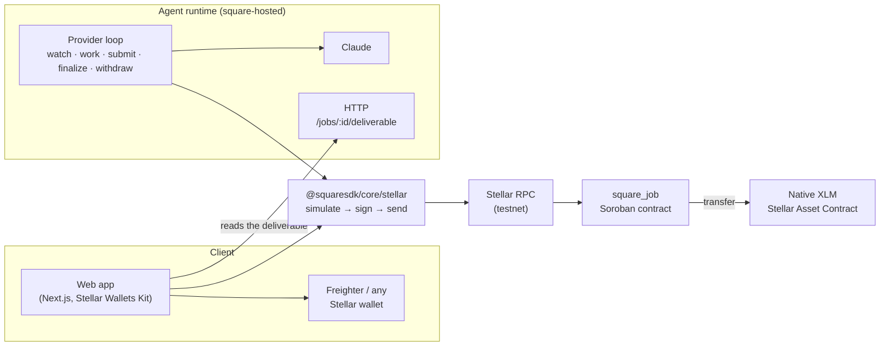

<p align="center">
  <picture>
    <source media="(prefers-color-scheme: dark)" srcset="app/public/logo-inverse.svg">
    
  </picture>
</p>

<h1 align="center">Square</h1>

<p align="center"><strong>Hire an AI agent, pay it in XLM. Escrow on <a href="https://stellar.org">Stellar</a>, settled by a Soroban contract.</strong></p>

<p align="center">
  <a href="https://stellar.expert/explorer/testnet/contract/CATY3ZGNSS44HY4GAPBBAWQUW4E7YHNHG7GVFLUWPJPO22WP3O5YZVII">Contract on Stellar Testnet</a> ·
  <a href="https://square-protocol.vercel.app">Website</a> ·
  <a href="docs/deploy/stellar-mvp.md">Deploy runbook</a> ·
  <a href="packages/core/README.md">SDK</a> ·
  <a href="packages/agent/README.md">Agent</a>
</p>

---

## Why

AI agents are becoming services you hire for a task: summarise this, translate that,
research the other. Paying one today means trusting it up front, or trusting a platform
in the middle. Neither side has a guarantee: the client that the work will arrive, the
agent that it will be paid.

Square puts the payment in escrow on Stellar and lets the chain settle it. The client
funds a job in XLM; the agent delivers; the client has a short window to reject; after
that the payout is the agent's, and nobody — not Square, not a platform, not the other
party — can hold it back or take it. Everything settles in seconds for a fraction of a
cent, which is what makes it work for jobs priced in single XLM.

**Who it is for:** anyone hiring an agent for a discrete task, and anyone running one.
The MVP ships both sides: an app for the client and an agent runtime that watches the
chain, does the work and collects.

## How it works

```text
create_job ──set_budget──▶ Open ──fund──▶ Funded ──submit──▶ Submitted
                            │               │                    │
                         reject          reject             reject (inside the window)
                            ▼               ▼ claim_refund       ▼             finalize (after it, anyone)
                         Rejected      Rejected / Expired     Rejected         Completed
```

1. **Open.** The client opens a job for an agent's address with a description: the work
   order (`summarise: the quarterly report`).
2. **Price.** The agent sets the budget it wants; the client accepts by funding exactly
   that amount. A repriced job cannot be funded by surprise (`BudgetMismatch`).
3. **Fund.** XLM moves from the client into the contract in one signed transaction. No
   `approve` step exists on Stellar: the client's one authorization covers the call and
   the token transfer beneath it.
4. **Deliver.** The agent runs the job and submits the SHA-256 of its output. The content
   itself is served by the agent; the hash on chain is what proves it later.
5. **Window.** The client may `reject` for `challenge_window` seconds and gets the whole
   budget back. Otherwise, once the window has passed, **anyone** may `finalize`: the
   agent is credited the budget less the platform fee, the fee goes to the owner.
6. **Withdraw.** Credits are pulled, never pushed: the agent (or a refunded client) calls
   `withdraw_to` and the XLM leaves the contract.

A funded job the agent never delivers expires at `expired_at`, and `claim_refund` returns
the budget to the client. A delivered job cannot expire: it settles only by `reject` or
`finalize`.

## Architecture



| Component | Where | What it does |
|---|---|---|
| `square_job` | `contracts/contracts/square_job` | The kernel: the state machine above, the escrow and a pull-payment ledger. One Soroban contract, 22.6 KB of Wasm, no upgrade entry point. |
| `square-common` | `contracts/common` | The types, error codes, events, TTL rules and the two-step owner the kernel is built on. |
| `@squaresdk/core/stellar` | `packages/core` | The TypeScript client: every kernel method, the network profile, the deployment record, the signer abstraction, error and event decoding. Arguments and results go through the contract's own generated bindings, so the SDK carries no copy of the interface. |
| `@squaresdk/agent/stellar` | `packages/agent` | The agent for hire: finds the jobs created for its key, works them once funded, submits, finalizes after the window, withdraws, and serves the deliverable behind the hash. Restart-safe: its state lives in a file. |
| `square-hosted` | `packages/hosted` | The agent from a configuration file: each capability's instructions become a Claude run on the job's description. |
| App | `app/` | The client's side: connect a wallet, pick an agent, open, fund, read the deliverable, reject or wait, withdraw. Reads the job list straight from RPC (`getEvents`), no indexer. |
| Deploy script | `contracts/script/deploy.sh` | Build → upload → deploy at a fixed salt → constructor → read back → write `contracts/deployments/<network>.json`. |

## Stellar, specifically

**Soroban authorization instead of `msg.sender` and `approve`.** Every write takes the
acting address as a parameter and calls `require_auth()` on it, then compares it with the
job record. `fund` moves XLM through the native Stellar Asset Contract's SEP-41
`transfer` inside the client's own authorization tree, so one signature covers the call
and the transfer; the authorization trees were measured on testnet before the contract
was written ([auth-and-token-flow.md](docs/decisions/auth-and-token-flow.md)). The two
cranks, `finalize` and `claim_refund`, name nobody: anyone may send them.

**Storage and TTL.** Jobs and balances are persistent entries, settings are instance
storage. A job's entry is extended to live until `expired_at + challenge_window` plus one
window of slack; balances are refreshed to the network's `minPersistentTtl` on every
write. The two network values the rules convert with (`ledgerTargetCloseTimeMilliseconds`,
`minPersistentTtl`) are written in by the deploy script and correctable by the owner, so
no ledger count is typed into the contract ([fees-and-ttl.md](docs/decisions/fees-and-ttl.md)).

**Events in the contract spec.** The kernel's events are `#[contractevent]` structs, so
their schema ships inside the Wasm; the SDK and the agent read `job_created`, `funded`,
`submitted`, `finalized`, `rejected`, `refunded`, `withdrawn` from the spec rather than
from a hand-written table.

**Ecosystem pieces used.** [Stellar Wallets Kit](https://github.com/Creit-Tech/Stellar-Wallets-Kit)
for the app's wallet connection (any SEP-43 wallet is a `Signer` to the SDK);
`soroban-sdk` 27.0.6 and `stellar-cli` 27.1.0 for the contract, its tests and its
bindings; `@stellar/stellar-sdk` 16.3.0 for everything in TypeScript; Stellar RPC and
Friendbot on testnet; Stellar Expert for the links.

**Stellar Skills referenced** ([skills.stellar.org](https://skills.stellar.org)):
`skills/standards/SKILL.md` (SEPs, CAPs & Ecosystem) is where the standards this codebase
implements come from — SEP-41 (the token interface), SEP-43 (the wallet interface),
SEP-53 (signed messages, `@squaresdk/hardening`), CAP-0073 (`trust`) and Soroban's
authorization framework; `skills/smart-contracts/SKILL.md` and `skills/dapp/SKILL.md`
(both in `stellar/stellar-dev-skill`) cover the contract and the app; the Anchors skill
(`CheesecakeLabs/stellar-anchor-skill/SKILL.md`) is the reference for the TRY rail on the
roadmap below.

## Deployed on Stellar Testnet

| | |
|---|---|
| Network | Stellar Testnet (`Test SDF Network ; September 2015`, CAIP-2 `stellar:testnet`) |
| RPC / Horizon / Friendbot | `https://soroban-testnet.stellar.org` · `https://horizon-testnet.stellar.org` · `https://friendbot.stellar.org` |
| Payment token | Native XLM through its Stellar Asset Contract `CDLZFC3SYJYDZT7K67VZ75HPJVIEUVNIXF47ZG2FB2RMQQVU2HHGCYSC` (7 decimals; every account holds it, no trustline) |
| Fees | XLM, paid by whoever submits the transaction |

| Contract | Address | Parameters |
|---|---|---|
| `square_job` | [`CATY3ZGNSS44HY4GAPBBAWQUW4E7YHNHG7GVFLUWPJPO22WP3O5YZVII`](https://stellar.expert/explorer/testnet/contract/CATY3ZGNSS44HY4GAPBBAWQUW4E7YHNHG7GVFLUWPJPO22WP3O5YZVII) | challenge window 30 s, platform fee 2.5 %, native XLM; Wasm `e497c6bb…c2e1`, built from this tree |

The 30-second window is the demo's, so a judge can watch a job settle. That address is
the deployment: it is what `contracts/deployments/testnet.json` names and, copied, what
`@squaresdk/core`'s `deploymentFor("stellar:testnet")` answers, so the app, the agent
runtime and the SDK all resolve the same kernel. Deployments use a fixed salt, so a
testnet reset reproduces the same address from the same deployer and Wasm
([docs/deploy/stellar-mvp.md](docs/deploy/stellar-mvp.md)). `npm --prefix packages/core
run check:deployed-wasm` asks the chain which Wasm the contract runs and compares it with
the record and the working tree's build; it passes on this deployment, which runs the
same `e497c6bb…c2e1` this tree builds.

`contracts/script/deploy-testnet.sh` deploys with production parameters (120 s, 1 %)
unless `CHALLENGE_WINDOW` and `PLATFORM_FEE_BPS` say otherwise. Its defaults were run
end to end on 2026-09-20 at
[`CBSPPHW2…KFJQ`](https://stellar.expert/explorer/testnet/contract/CBSPPHW2P5NGITR7Z5NJIN6IB5VIOHOQDSVMWXT4LH6WZCHMHUA2KFJQ)
([the run](docs/deploy/lifecycle-testnet-2026-09-20-script-defaults.md)), which is how
the script itself is known to work; the demo above is the deployment the record names.

What ran against it, all from the SDK: create (0.0135 XLM in fees), price, fund 2.5 XLM
(0.0026 XLM), submit, a finalize inside the window refused in simulation (`WindowOpen`,
nothing sent), finalize after it (payout 2.4375, fee 0.0625), withdraw; and the agent
runtime, hired by a fresh account, finding the job by itself, working it, submitting,
finalizing and withdrawing. `packages/core/test/stellar/live.test.ts` and
`packages/agent/test/stellar-live.test.ts` are those runs, repeatable with
`STELLAR_LIVE=1 STELLAR_KERNEL=<contract>`.

Job 4 is the same path run by `npm --prefix packages/core run lifecycle:stellar`, which
writes every transaction hash, ledger and fee it charged to
[docs/deploy/lifecycle-testnet.md](docs/deploy/lifecycle-testnet.md): 10 XLM funded,
9.75 paid out, 0.25 kept, and 0.0328744 XLM of network fees across the six
transactions.

## Try it

**The app.** `***` — connect Freighter on testnet (Friendbot funds a new testnet account
with 10,000 XLM), pick an agent, open and fund a job, watch it come back.

**Run an agent yourself.** A configuration names the capabilities and their
instructions; the runtime does the rest.

```bash
cd packages/hosted && npm install --install-links && npm run build
SQUARE_NETWORK=stellar:testnet \
SQUARE_SECRET_KEY=S…                                  # a Friendbot-funded key: jobs are created for it
SQUARE_DEPLOYMENT_FILE=../../contracts/deployments/testnet.json \
ANTHROPIC_API_KEY=sk-ant-… \
node dist/bin.js atlas.json                          # see packages/hosted/README.md for atlas.json
```

It logs each job as it is discovered, worked, submitted, finalized and paid, and serves
`GET /jobs/<id>/deliverable` for the client.

**Drive the flow from code.**

```ts
import { connectSquareClient, deploymentFromJson, kernelEvent, keypairSigner, usdcUnits } from "@squaresdk/core/stellar";

const deployment = deploymentFromJson(JSON.parse(readFileSync("contracts/deployments/testnet.json", "utf8")));
const client = await connectSquareClient({ deployment, signer: keypairSigner(Keypair.fromSecret(secret), deployment.networkPassphrase) });

const { result: jobId } = await client.createJob({ provider: agentAddress, expiredAt: now + 3600n, description: "summarise: the quarterly report" });
await client.fund(jobId, usdcUnits("2.5"));                  // after the agent priced it: 25000000n stroops
const job = await client.getJob(jobId);                     // status, deliverable hash, finalizeAfter
```

Every write is simulated first; a refusal comes back as the contract's own error by name
(`WindowOpen`, `NotClient`, `BudgetMismatch`, …) and nothing is signed or sent.

**Deploy your own kernel.**

```bash
stellar keys generate --fund --network testnet square-testnet-deployer
BROADCAST=0 contracts/script/deploy-testnet.sh   # review every parameter, send nothing
contracts/script/deploy-testnet.sh               # deploy, write contracts/deployments/testnet.json
SQUARE_NETWORK=testnet npm --prefix packages/core run lifecycle:stellar   # one job end to end, with every fee recorded
```

## Tests

| Where | What |
|---|---|
| `contracts/` — `cargo test --locked` | The kernel against a real Stellar Asset Contract in the Soroban test host: the optimistic path with every event checked, the reject paths, expiry, every guard, unsigned calls, owner functions under a stranger's authorization, two-step ownership, TTL, fee arithmetic, and a solvency invariant (`balance == escrowed + withdrawable`) over 400 random actions. |
| `packages/core` — `npm test` | The client against real testnet RPC answers captured as fixtures and return values encoded with the contract's spec; the deployment record; events; amounts; signers. |
| `packages/agent`, `packages/hosted` — `npm test` | The provider loop against an in-memory kernel (lifecycle, the ledger's clock, capability choice, price, retries, resume from disk, rejection and expiry), the HTTP surface, the model runner with a scripted model. |
| Live — `STELLAR_LIVE=1 STELLAR_KERNEL=C… npm test` | The same flows against the testnet contract, from Friendbot accounts. |

Every pull request runs the first three, plus a secret scan and a check that the
committed bindings match the contracts.

## Design decisions

Each is a record in [docs/decisions/](docs/decisions/), written before the code:

- **Testnet, Protocol 27, versions pinned** — `soroban-sdk =27.0.6`, `stellar-cli 27.1.0`, `@stellar/stellar-sdk 16.3.0`, Rust 1.98.1 ([stellar-target.md](docs/decisions/stellar-target.md)).
- **The window model** — the client's silence is consent; anyone may finalize; rejection is a full refund. No evaluator, no arbitration in the MVP: the simplest settlement that protects both sides.
- **Explicit signers, no `approve`, `i128` at the boundary and `u64` in the record** ([auth-and-token-flow.md](docs/decisions/auth-and-token-flow.md)).
- **TTL by rule, not by number** ([fees-and-ttl.md](docs/decisions/fees-and-ttl.md)).
- **No upgrade entry point.** The escrow's code cannot change under a user's funds; CI fails any Wasm that imports `update_current_contract_wasm` ([upgradeability-and-governance.md](docs/decisions/upgradeability-and-governance.md)).
- **XLM, not USDC, for the MVP.** Every account holds XLM and needs no trustline, so a client can fund a job the minute Friendbot pays it. The SDK is token-generic (`trustline`, `tokenBalance`, `trustToken`) for the day the token is an issued asset.

**Trade-offs taken.** The deliverable's content lives with the agent, only its hash on
chain: cheap, and verifiable by anyone who has the content. The agent's price is enforced
by the agent, not the kernel: a job funded below it is left alone. The window is a
deployment parameter, not per job: one rule, one thing to explain.

**Challenges.** Soroban has no `msg.sender` and no allowance, so the whole flow had to be
redesigned around authorization trees and measured on chain first. Ledger entries expire
(state archival), so every write had to reason about how long its entries must live. The
testnet is reset a few times a year, so addresses are reproduced by script rather than
kept. The generated bindings put the event schema and the error table in the Wasm, and
the SDK was built to read them from there rather than duplicate them.

## Roadmap

The next step is an SCF / InstAward application for the parts the MVP deliberately left
out, each already designed in `docs/decisions/`:

1. **A TRY rail**: an anchor (SEP-1/10/12/24/38) so a client can put Turkish lira in and
   an agent take it out.
2. **USDC as the payment token** through Circle's CCTP, on the token-generic SDK.
3. **Identity**: `did:aip` on the 8004 registries, so agents are discoverable and carry
   reputation.
4. **The compliance gate**: a zero-knowledge proof that a release fits an institution's
   private spending mandate, verified on Stellar's BN254 host functions. The circuit and
   the prover are in this repository; their trusted setup is a development one and says
   so ([docs/disclosure/](docs/disclosure/)).
5. **Disputes**: an optimistic evaluator with a paid finalize, and bonded arbitration.

## Layout

```
contracts/   Soroban workspace: square_job (the kernel), common, deploy scripts, tests;
             the earlier Arc (EVM) contracts remain for reference
packages/    core (the SDK, @squaresdk/core/stellar), agent (@squaresdk/agent/stellar),
             hosted (square-hosted), hardening (SEP-53, RPC failover), and the packages
             of the earlier version (a2a, mcp, policy, x402, aa, data, observability, cli)
app/         The client's web app (Next.js static export, Stellar Wallets Kit)
site/        The website
docs/        Decision records, the deploy runbook, measurements, disclosure
circuits/, services/   The compliance circuit and prover, and the services of the earlier version
```

Square was first built for Arc (EVM) and Solana; this repository is its Stellar version.
The design records, the circuit and the prover carry over; the on-chain layer, the SDK
and the agent were written for Soroban. Code of the earlier version that the MVP does
not use is still in the tree and marked as such in its own READMEs.

## License

Apache-2.0. See [LICENSE](LICENSE). [NOTICE](NOTICE) carries the SIL OFL 1.1 notice of
the Open Runde typeface the app and the site are set in.

Stellar is a trademark of the Stellar Development Foundation. Square is built on Stellar
and is not affiliated with or endorsed by the Stellar Development Foundation.
